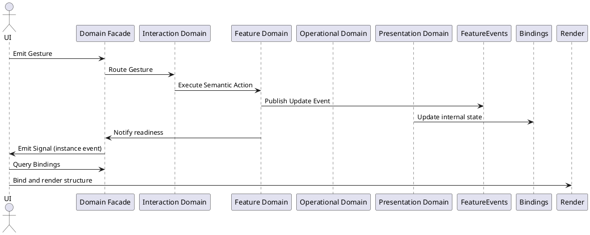

**Author**: Joshua Ramirez  
**Context**: Domain-Driven UI Architecture — Semantic Temporal Control

---

## 📘 Introduction

The **Temporal Projection Protocol** defines how and when **UI rendering may occur** in a domain-driven system.

It enforces that **mutation is not enough**. The system must emit an **explicit signal via the Facade instance** to inform the UI that renderable state is stable.

This is a **permission system**, ensuring:

- Declarative rendering
- Temporal correctness
- Strict causal separation between domain and UI

✅ **Signals are Facade instance events, distinct from internal domain Update Events.**

---

## ✅ Core Principle: Temporal Readiness Contract

> **UI rendering is authorized only by Signals.**  
> Internal mutation is managed separately via Update Events.

|Requirement|Description|
|---|---|
|✅ Signals must notify readiness|UI must not bind before Signal|
|✅ Queries must follow Signals|UI traverses Bindings only after Signal|
|✅ Update Events carry domain data internally|Only Update Events (inside domain) may carry state|
|✅ Signals decouple UI layers|Domain emits internal Updates → Facade emits external Signals|

---

## 🔁 System Flow Overview

```plaintext
1. UI emits gesture
2. Facade routes to Interaction
3. Interaction invokes Feature or Presentation
4. Feature mutates semantic state
5. Feature emits Update Events internally
6. Presentation subscribes and updates internal Binding state
7. Facade emits Signal externally
8. UI listens to Signal
9. UI queries Bindings from Facade
10. UI rebinds
````

✅ Clear distinction between **Update Event** flow (internal) and **Signal** flow (external).

---

## 📡 Feature → Presentation Synchronization via Update Events

The Feature domain emits **Update Events** to the **FeatureEvents mediator**.  
Presentation subscribes internally and mutates private Binding state.

### Example Update Events (domain-internal)

```csharp
// Feature:
_featureEvents.PublishRowProgressUpdated(rowId, percent);
_featureEvents.PublishRowCompleted(rowId);
```

```csharp
// Presentation subscription:
_featureEvents.SubscribeRowProgressUpdated(OnRowProgressUpdated);
_featureEvents.SubscribeRowCompleted(OnRowCompleted);
```

✅ Internal only.  
✅ Update Events may carry meaningful data (rowId, progress, etc).

---

## 📣 Facade → UI Synchronization via Signals

The Facade listens to Feature readiness and emits **Signals**.

### Legal pattern:

```csharp
// Feature triggers internal readiness
_rowManager.RowCompleted += id => _featureEvents.PublishRowCompleted(id);

// Facade subscribes internally
_featureEvents.SubscribeRowCompleted(id => RowCompleted?.Invoke(id));

// UI listens to Facade instance Signal
facade.RowCompleted += id => {
    var row = facade.Bindings.Rows[id];
    RenderRow(row);
};
```

✅ **Signals** are minimal — only notify readiness, never carry state.

---

## 🧱 Signal Rules (Facade ➔ UI)

|Rule|Description|
|:--|:--|
|✅ Signals must be instance events on the Facade|No static buses|
|✅ Signals must carry only minimal keys|IDs, not DTOs|
|✅ UI must only query Bindings after Signal|No speculative rendering|
|✅ UI remains passive|Signal grants permission, not payloads|

---

## ✨ Event Typology Summary

|Event Type|Carrier|Payload Allowed|Target|
|:--|:--|:--|:--|
|**Update Event**|Feature ➔ Presentation|✅ (state data allowed)|Internal binding mutation|
|**Signal**|Facade ➔ UI client|❌ (notification only)|External UI rebind authorization|

---

## 🌿 Structural vs Semantic Signals

|Source|Characteristics|
|:--|:--|
|**Semantic**|Feature domain state stabilization (e.g., RowCompleted)|
|**Structural**|Presentation UX-local transitions via Behavior (e.g., ModalOpened)|

✅ Signals treat both as "readiness to bind" — not data transmission.

---

## 🔁 Updated Signal Flow Diagram



---

## 📜 Binding Hierarchy Rules

- Facade exposes triadic Binding roots (`IBatchScreenBindings`).
    
- No query methods needed — Bindings tree is declarative.
    
- Child components (Rows, Modals) are exposed structurally via properties/dictionaries.
    

✅ UI rebinds structurally after Signal reception.

---

## 🧩 Presentation Responsibilities

|Responsibility|Behavior|
|:--|:--|
|✅ Subscribe to Update Events|Private internal state mutation|
|✅ Implement Triadic Interface|Expose Bindings/Behaviors|
|✅ Only expose readonly Bindings externally||
|✅ Never emit Signals|Only Facade emits outward signals|
|✅ Accept Behavior calls from Interaction|For UX-local structural transitions only|

---

## 🧠 UI Responsibilities

- Must never bind until after Signal received.
    
- Must query Bindings via Facade only.
    
- Must not infer readiness from gesture execution.
    
- Must not listen directly to Feature or Presentation events.
    

---

## ✅ Correct Usage Pattern

```csharp
// Feature publishes Update Event
_featureEvents.PublishRowCompleted(rowId);

// Presentation subscribes
_featureEvents.SubscribeRowCompleted(rowId => _rows[rowId].MarkCompleted());

// Facade emits UI Signal
featureEvents.SubscribeRowCompleted(rowId => RowCompleted?.Invoke(rowId));

// UI listens and rebinds
facade.RowCompleted += rowId => {
    var row = facade.Bindings.Rows[rowId];
    RenderRow(row);
};
```

✅ Full causality.  
✅ Temporal readiness enforced.  
✅ UI remains passive and declarative.

---

## 🚫 Anti-Patterns

```csharp
// ❌ Presentation emitting events outward
_presentationComponent.EmitRowCompleted(); // Forbidden

// ❌ Feature sending DTO payload in Signal
RowCompleted?.Invoke(new RowBindingModel { ... }); // Forbidden

// ❌ UI querying Bindings before Signal
var row = facade.Bindings.Rows[id]; // too early
```

---

## 🧭 Closing Principle

> **Rendering is not triggered by state change — it is authorized by domain Signals.**

- Feature progresses domain meaning.
    
- Feature publishes Update Events internally.
    
- Presentation updates structure.
    
- Facade signals outward permission to UI.
    
- UI rebinds declaratively.
    

✅ Causal separation.  
✅ Temporal decoupling.  
✅ Structural purity.  
✅ Declarative and safe rendering.

---
